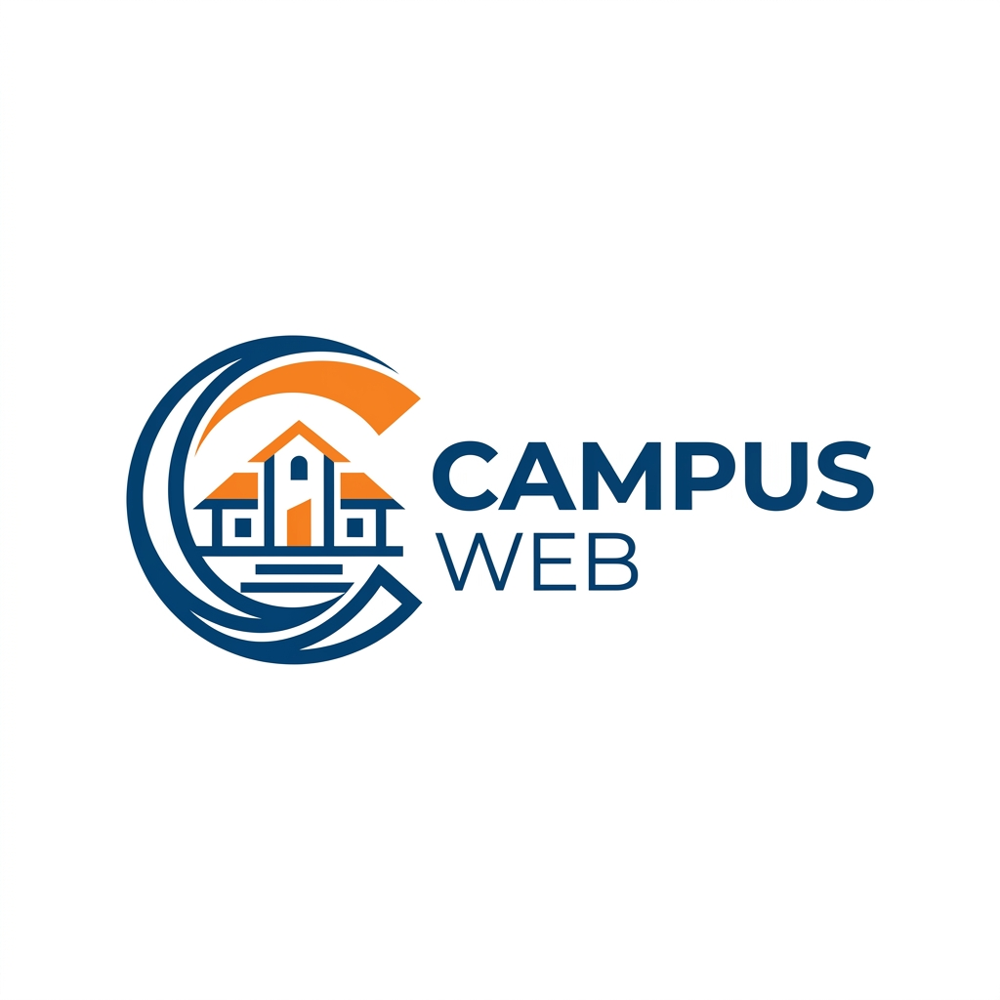

<p align="center">
  
</p>

<h1 align="center">CampusWeb</h1>

<p align="center">
  <strong>An unofficial, premium university portal created by an SRH student.</strong>
</p>

<p align="center">
  <a href="https://github.com/ettefagh/campusweb/stargazers"></a>
  
  <a href="LICENSE"></a>
  <br>
  
  
  
</p>

---

CampusWeb is a modern Progressive Web App (PWA) designed to provide SRH University students with instant access to essential resources. It combines a powerful calendar aggregator, campus news feed, and a curated resource database into a single, high-performance interface.

## 🚀 Key Features

- 📱 **Mobile-First PWA** — Installable on iOS/Android with full offline support.
- 📅 **Smart Calendar** — Aggregates university events and personal iCal feeds with auto-naming.
- 📰 **Campus Hub** — Real-time news feed including Instagram embeds and university announcements.
- 🔍 **Universal Search** — Instant access to a curated database of SRH links and documents.
- ⭐ **Quick Access** — Pin your most-used resources to your personal dashboard.
- 🌙 **Adaptive Design** — Seamless dark mode and high-contrast accessibility support.
- ♿ **Inclusive** — WCAG 2.2 Level AA compliant with optimized touch targets.

## 🛠️ Tech Stack

| Layer | Technology |
| :--- | :--- |
| **Framework** | [SvelteKit 2.x](https://kit.svelte.dev/) + TypeScript |
| **State Management** | Svelte Stores (Persistent LocalStorage) |
| **Styling** | Vanilla CSS (Modern CSS Variables & Grid) |
| **Infrastructure** | [Cloudflare Pages](https://pages.cloudflare.com/) |
| **Calendar Engine** | [@event-calendar](https://github.com/vkurko/calendar) |
| **PWA Engine** | Custom Service Worker (Cache-first Strategy) |

## 📂 Project Structure

```bash
campusweb/
├── src/
│   ├── routes/             # SvelteKit App Router (Calendar, Feed, Search)
│   ├── lib/
│   │   ├── components/     # UI Design System
│   │   ├── stores/         # Persistent state management
│   │   └── utils/          # iCal processing & link logic
│   └── service-worker.ts   # PWA Offline logic
├── static/                 # PWA Assets & Icons
└── wrangler.toml           # Cloudflare deployment config
```

## 🚥 Getting Started

### Prerequisites

- **Node.js** 20.x or higher
- **npm** 10.x or higher

### Installation

1. **Clone and Install**
   ```bash
   git clone https://github.com/ettefagh/campusweb.git
   cd campusweb
   npm install
   ```

2. **Configuration**
   ```bash
   cp wrangler.toml.example wrangler.toml
   ```

3. **Development**
   ```bash
   npm run dev
   ```

## 🔒 Privacy & Security

CampusWeb is built with a **Privacy-First** architecture:

- 🛡️ **Zero Analytics**: No tracking, no cookies, no third-party telemetry.
- 📦 **Local Persistence**: All personal data (favorites, subscriptions) stays in your browser's `localStorage`.
- ☁️ **Serverless Proxy**: Calendar URLs are processed via a zero-knowledge AES-GCM encrypted proxy.
- 📜 See [SECURITY.md](SECURITY.md) for detailed privacy documentation.

## 🤝 Contributing

Contributions are welcome! Whether it's adding new SRH resources or improving the UI, please see [CONTRIBUTING.md](CONTRIBUTING.md) to get started.

## 📄 License

This project is licensed under the MIT License - see the [LICENSE](LICENSE) file for details.

## ⚠️ Disclaimer

**CampusWeb is an independent, student-led project.** It is **not** an official application of SRH University, nor is it endorsed or maintained by the university administration. This tool was developed by an SRH student to improve the digital experience for the student community. All trademarks and university resources belong to their respective owners.

---

<p align="center">
  Built with ❤️ by an SRH University student.
</p>
